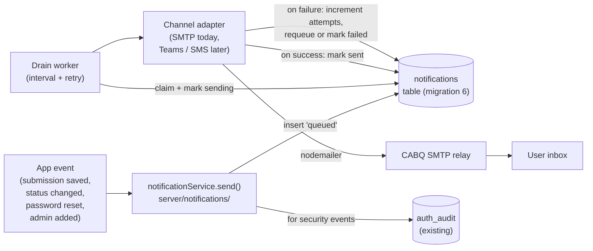
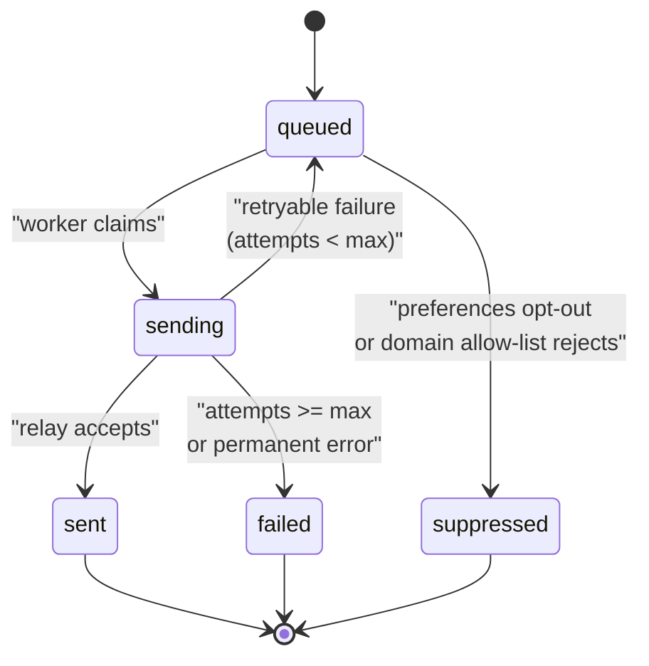

# Email & Notifications Roadmap

**Status:** Design doc. No code in this release; this document locks in
the foundation so we can build notifications later without retrofitting
the app.

**Audience:** App team, infrastructure/ops, and anyone reviewing future
PRs that add notification features.

---

## Goals

Future features that depend on this foundation:

- Confirmation email when a user submits a Comprehensive Plan action.
- Status-change notification when an admin transitions a submission
  (draft -> submitted -> reviewed -> etc.).
- Admin-initiated password reset email for local accounts (a real email
  instead of only showing the new password in the admin UI).
- Security alerts when critical auth events happen (new admin added,
  admin removed, repeated failed logins from a single IP).
- Weekly digest to administrators summarizing new submissions,
  lifecycle turnaround, and coverage gaps.
- Potential future channels: Microsoft Teams message, SMS, in-app
  notifications.

**Non-goals (explicitly out of scope for v1):**

- Marketing / bulk email.
- End-user inbound email processing (replies become support tickets,
  handled by the `comp-plan-support@cabq.gov` mailbox staff check
  manually).
- SMS today (keep the interface channel-agnostic so we can add it later).

---

## What we are doing **now** (this release)

Zero code changes. Two documentation-only items:

1. **Reserve env var names** so existing `.env` files can be pre-populated
   by Ops without breaking anything. The server currently ignores these.
   Listed below under "Reserved environment variables."
2. **One addition to the Ops request** (already in
   [deployment/OPS-REQUEST-DNS-CERT.md](../deployment/OPS-REQUEST-DNS-CERT.md))
   asking for SMTP relay details and a `comp-plan-noreply@cabq.gov`
   sender address.

That is all. The working app keeps running on v4.2.1 with no behavioral
change.

---

## Reserved environment variables

Add these to `.env.example` (and eventually `.env`) so we can configure
the environment in advance. The app does not read them until the v5.x
notifications release, at which point `NOTIFICATIONS_ENABLED=false` is
the safe default and has to be explicitly flipped on.

```ini
# --- Email / notifications (reserved for v5.x) ---

# Master toggle. Leave unset or false until the notifications release ships.
NOTIFICATIONS_ENABLED=false

# SMTP relay (CABQ internal relay). Ask Ops for these values.
SMTP_HOST=smtp.cabq.gov
SMTP_PORT=587
SMTP_SECURE=starttls          # none | starttls | tls
SMTP_AUTH=none                # none | basic | oauth2
SMTP_USER=                    # only if SMTP_AUTH=basic
SMTP_PASS=                    # only if SMTP_AUTH=basic

# Sender identity. Must be an address the SMTP relay allows us to send as.
SMTP_FROM=comp-plan-noreply@cabq.gov
SMTP_FROM_NAME=CABQ Comprehensive Plan
SMTP_REPLY_TO=comp-plan-support@cabq.gov

# Recipient safety controls.
NOTIFICATIONS_ALLOWED_DOMAINS=cabq.gov
# When NODE_ENV=development, any outbound is redirected here instead.
NOTIFICATIONS_DEV_REDIRECT=
```

Separately, the background worker gets these tuning knobs:

```ini
NOTIFICATIONS_MAX_ATTEMPTS=5
NOTIFICATIONS_RETRY_DELAY_SECONDS=60
NOTIFICATIONS_DRAIN_INTERVAL_SECONDS=15
```

---

## Architecture (planned, v5.x)

The **core principle**: we never trust SMTP to succeed inline. Every
notification lands in a SQLite outbox table first, then a background
worker drains it with retries. That way a transient relay outage does
not cost us messages, and we get a full delivery audit trail for
compliance.



---

## Planned module layout

All under `server/notifications/` except the admin UI:

| File | Responsibility |
|---|---|
| `server/notifications/notificationService.ts` | Public API: `send(type, recipient, data)`. Resolves the template, renders it, and inserts into the outbox. |
| `server/notifications/notificationsRepo.ts` | DB access for the `notifications` and `notification_preferences` tables. |
| `server/notifications/templates/` | One file per notification type - the subject + plaintext + HTML bodies with Handlebars-style `{{placeholders}}`. Checked-in, versioned with the repo. |
| `server/notifications/channels/smtp.ts` | nodemailer adapter. |
| `server/notifications/channels/teams.ts` (later) | Microsoft Graph `/chatMessages` adapter. Interface is identical. |
| `server/notifications/drainWorker.ts` | Background loop that claims queued rows, calls the channel, updates status. |
| `server/notifications/notificationsRoutes.ts` | Admin API: list log, re-queue failures, test-send. |
| `src/admin/NotificationsPage.tsx` | Admin console page - template preview, delivery log, test-send. |
| `server/notifications/notifications.test.ts` | Vitest unit tests (outbox lifecycle, retry, template rendering). |

---

## Planned database migration (migration 6)

```sql
-- Outbox. One row per notification attempt lifecycle.
CREATE TABLE notifications (
  id             INTEGER PRIMARY KEY AUTOINCREMENT,
  type           TEXT NOT NULL,      -- e.g. 'submission.received'
  channel        TEXT NOT NULL,      -- 'email' | 'teams' | 'sms'
  recipient      TEXT NOT NULL,      -- email address / teams user id / phone
  subject        TEXT,
  body_text      TEXT,
  body_html      TEXT,
  data_json      TEXT,               -- template variables snapshot, for audit
  status         TEXT NOT NULL DEFAULT 'queued',
  -- queued | sending | sent | failed | suppressed
  attempts       INTEGER NOT NULL DEFAULT 0,
  last_error     TEXT,
  created_at     TEXT NOT NULL,
  sent_at        TEXT,
  next_attempt_at TEXT,
  related_id     TEXT                -- e.g. submission.id for cross-reference
);
CREATE INDEX idx_notifications_status_next
  ON notifications (status, next_attempt_at);
CREATE INDEX idx_notifications_type_created
  ON notifications (type, created_at);
CREATE INDEX idx_notifications_related
  ON notifications (related_id);

-- Per-user opt-in/out per notification type.
CREATE TABLE notification_preferences (
  user_id        TEXT NOT NULL,      -- local_users.id or Entra OID
  type           TEXT NOT NULL,
  enabled        INTEGER NOT NULL DEFAULT 1,
  updated_at     TEXT NOT NULL,
  PRIMARY KEY (user_id, type)
);
```

Status lifecycle:



---

## Hook points in existing code

When we implement v5.x, these are the exact call sites we will wire
notifications into. No changes today - just a map.

| Event | Existing code | Notification type |
|---|---|---|
| User saves a draft submission | `insertSubmission` in [server/submissionsRepo.ts](../server/submissionsRepo.ts) | none (too noisy) |
| User submits (first `draft -> submitted` transition) | `patchSubmission` / `patchAny` in [server/submissionsRepo.ts](../server/submissionsRepo.ts) | `submission.received` to submitter |
| Admin changes a submitted record's status | `patchAny` in [server/submissionsRepo.ts](../server/submissionsRepo.ts) | `submission.status_changed` to owner |
| Admin resets a local user's password | `server/localAuthRoutes.ts` (`/api/admin/users/:id/reset-password`) | `account.password_reset` to that user |
| New local admin added | `server/localUsersRepo.ts` + audit event in `auth_audit` | `security.admin_added` to the admin DL |
| Account locked out after repeated failures | `server/localAuthRoutes.ts` login handler + `auth_audit` | `security.account_locked` to admin DL |
| Weekly on Monday 08:00 MT | new scheduled job in `server/notifications/drainWorker.ts` | `digest.weekly` to admins |

---

## Template format (decision)

Handlebars (via `handlebars` npm package) with the three pieces per type:

- `subject.hbs` - single line, `{{placeholder}}` allowed.
- `body.txt.hbs` - plaintext fallback.
- `body.html.hbs` - HTML body, inline styles only (Outlook compatibility).

Templates live in `server/notifications/templates/<type>/...` and are
loaded at startup. Admins can override a subject or body via the admin UI
without a deploy - overrides are stored in a future `notification_templates`
table (migration 7, when that capability is asked for).

Example template file layout (not created today):

```
server/notifications/templates/
  submission.received/
    subject.hbs          -> "Comprehensive Plan action received: {{title}}"
    body.txt.hbs
    body.html.hbs
  submission.status_changed/
    subject.hbs          -> "Your plan action {{title}} is now {{newStatus}}"
    body.txt.hbs
    body.html.hbs
  account.password_reset/
    subject.hbs          -> "Your CABQ Comprehensive Plan password was reset"
    body.txt.hbs
    body.html.hbs
  ...
```

---

## Admin UI (planned)

New top-level tab in the admin console, placed under the `Security`
nav group alongside Reports:

```
Admin console
  Submissions
  Security:
    Users
    Roles
    Sign-in settings
    Audit log
    Reports
    Notifications         <- NEW
```

The Notifications page has three sub-views:

1. **Templates** - list of notification types. Click one to preview
   subject / text / HTML with a sample data set, and optionally override.
2. **Delivery log** - paginated list from the `notifications` table.
   Filters on status, type, recipient, date range. Click a row to see
   the full rendered body plus the `data_json` snapshot and error
   history. Re-queue action for `failed` rows.
3. **Test send** - pick a type + a sample recipient + fill in data
   variables; sends a one-off through the outbox with a `test: true`
   flag so it shows up in the log but does not count toward digests.

---

## Security, compliance, and safety rules (to bake in from day one)

- **Never log secrets.** Password reset emails include the one-time link,
  not the raw password. Local-admin reset flow stays admin-initiated only.
- **Never log full PII.** `data_json` is redacted for email addresses
  (first letter + domain) beyond 30 days.
- **Domain allow-list.** `NOTIFICATIONS_ALLOWED_DOMAINS` defaults to
  `cabq.gov`. Sends to other domains go to status `suppressed` unless an
  admin explicitly allows the domain per-template.
- **Dev redirect.** If `NODE_ENV=development` and
  `NOTIFICATIONS_DEV_REDIRECT` is set, every outbound email reroutes
  there with the original recipient preserved in a header. Prevents
  accidental email blasts from local testing.
- **Preferences are user-visible.** Users can view and change their own
  opt-ins on a profile page (planned v5.1) without admin involvement.
- **Rate limit.** No more than N messages of the same type to the same
  recipient in M minutes (default 1 / 60). Prevents runaway notification
  loops.
- **Audit.** Every admin-triggered send or override writes to `auth_audit`
  so it is visible in the existing Audit log page.

---

## Phased rollout

Once Ops answers the SMTP questions in
[deployment/OPS-REQUEST-DNS-CERT.md](../deployment/OPS-REQUEST-DNS-CERT.md),
we build this in phases similar to the Reports initiative:

| Version | Scope |
|---|---|
| **v5.0.0** | Migration 6, notificationService, SMTP channel, outbox drain worker, admin delivery log. No user-facing emails enabled yet; NOTIFICATIONS_ENABLED stays off. |
| **v5.1.0** | Wire in `submission.received` and `submission.status_changed`. Add user preferences page. Enable in dev. |
| **v5.2.0** | Add `account.password_reset`, security alerts, admin DL routing. Enable in staging. |
| **v5.3.0** | Weekly digest job. Template override UI (migration 7). Production roll-out. |
| **v5.4.0+** | Optional: Microsoft Teams channel (MS Graph). |

Each phase gets its own PR and tag, just like v4.0.0 / v4.1.0 / v4.2.0.

---

## Open questions (to resolve before v5.0.0 development starts)

1. **SMTP vs Microsoft Graph `sendMail`?** Graph is nicer for CABQ
   (identity-aware, no separate relay credentials, better DMARC
   alignment). SMTP is simpler and CABQ relays already exist. **We will
   support both behind the channel interface;** Ops's answer to Request
   4 will decide which ships first.
2. **Shared mailbox identity?** Do we send as
   `comp-plan-noreply@cabq.gov` (dedicated, recommended) or a generic
   `donotreply@cabq.gov` (may already exist)?
3. **Retention.** How long do we keep rows in `notifications`? Proposed:
   90 days for successful sends, 365 days for failures. Needs
   records-retention policy check.
4. **Accessibility of HTML bodies.** All templates must be screen-reader
   friendly (proper headings, alt text, no layout tables). Add an
   `axe-core` CI check for template HTML before v5.0.0 ships.

---

## Reference

- Operational cutover guide: [deployment/PUBLISH-TO-DEV-DNS.md](../deployment/PUBLISH-TO-DEV-DNS.md)
- Ops ticket template (includes SMTP request): [deployment/OPS-REQUEST-DNS-CERT.md](../deployment/OPS-REQUEST-DNS-CERT.md)
- Existing audit pattern we will mirror: [server/auditRepo.ts](../server/auditRepo.ts)
- Existing migration pattern we will follow: [server/db/database.ts](../server/db/database.ts) (see migrations 1-5)
